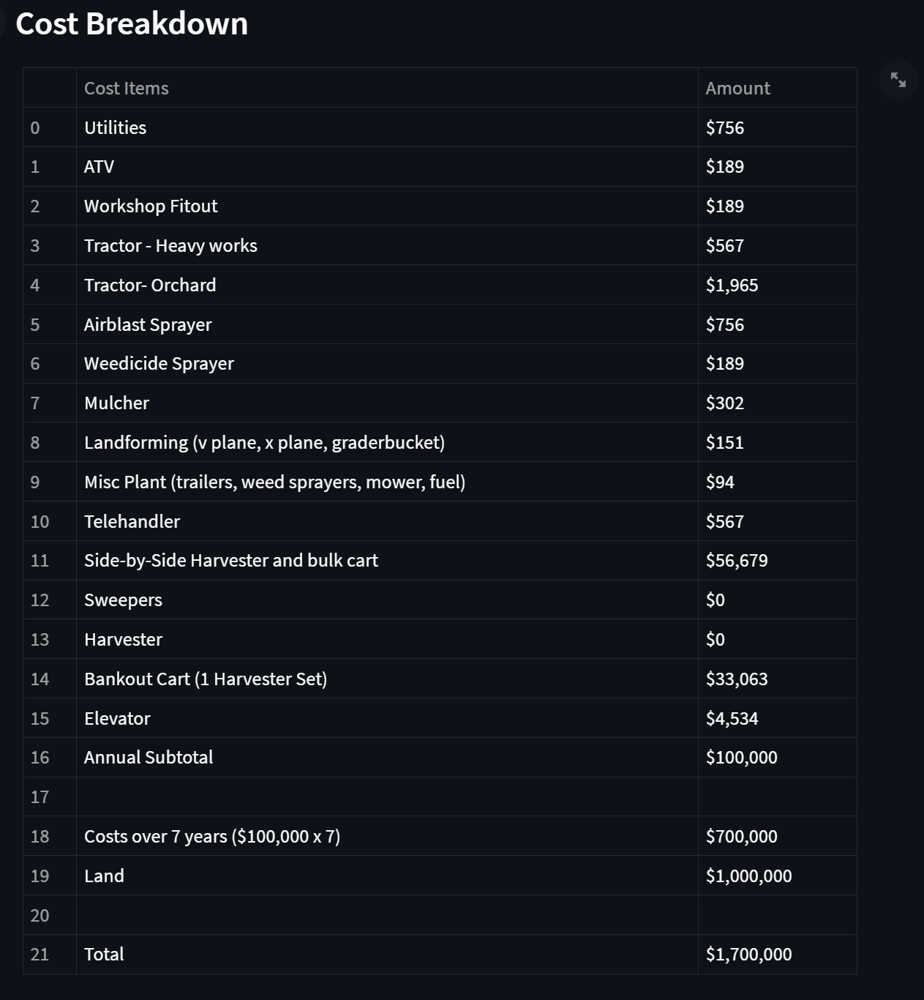
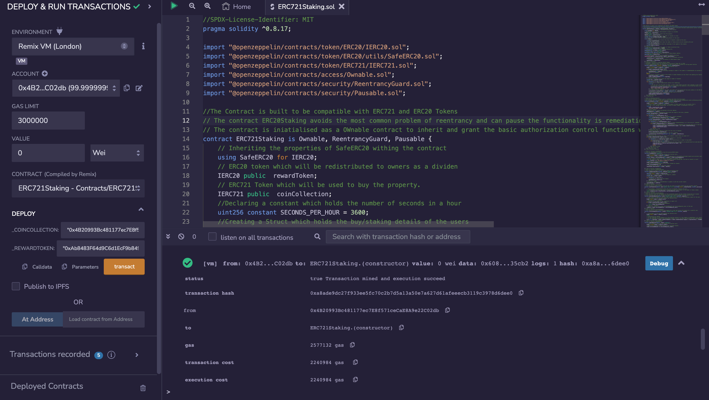
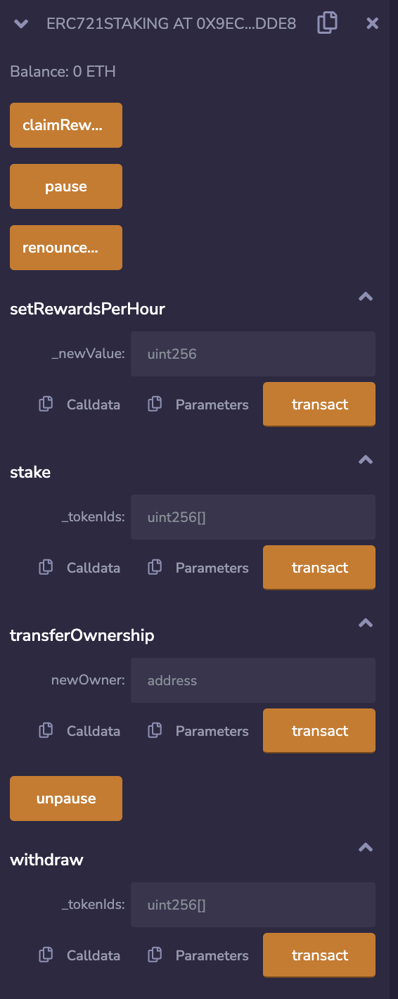
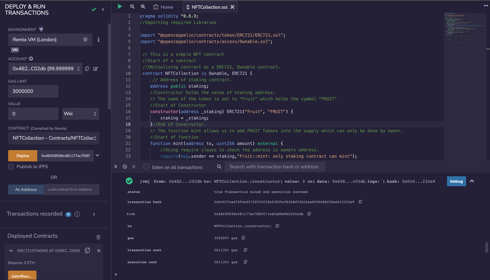
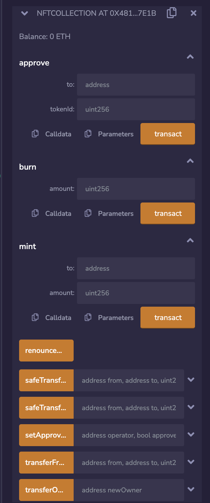
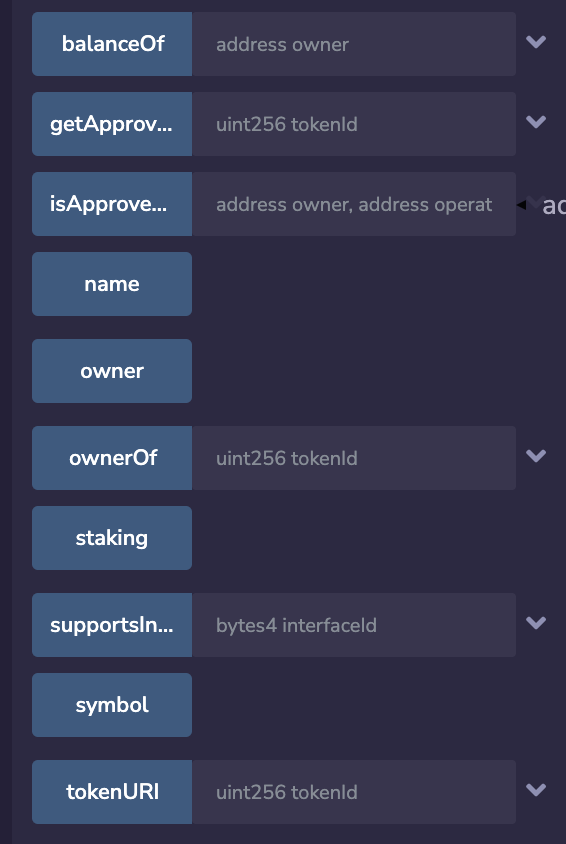
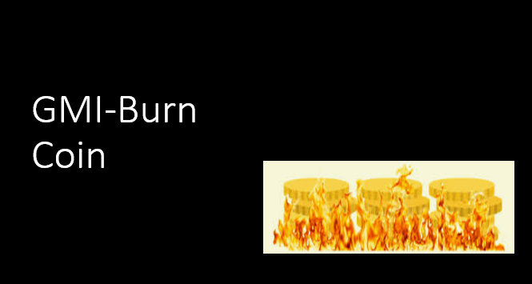
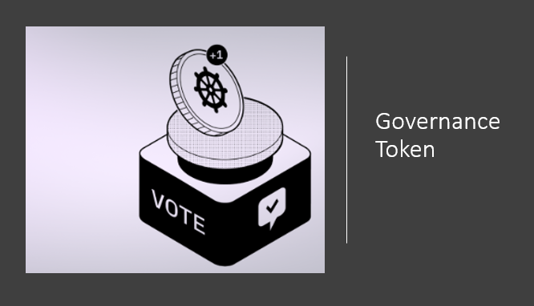

# Melbourne_Ag_Co-op

## About the project
Melbourne Ag Co-op was established in 2022 by a group of like minded entrepreneurs. With a diverse mix of backgrounds from software engineers to Agriculture scientists, this team of specialists have acquired existing farms in the Gippsland region of Victoria and minted the 'nut' token (NUT).

We successfully developed a solidity based application with staked tokens tied to the annual valuation of the established business. Operating costs are deducted from sales revenue (pistachio kernels) before being distributed to token holders. 

  - Earn yearly dividends
  - Use your ETH
  - Sustainable investment 

## Valuation assessment

#### Streamlit interface:

Streamlit was used to demonstrate the projected value of Melbourne Ag Co-Op.  The assumption used was 2% capital growth based off the initial investment $1,700,000.  

## Deployment
### Deployment of ERC721Staking

#### Deployed Contract in Remix. 

#### Features of Users: 

Using this contract users can ClaimRewards(Dividends) by depositing their ERC721 Token/s and to unstake(Sell) their ERC721 Tokens. 

#### Features of Owner

Owner of this contract can set/alter the reward for the users, pause/unpause the staking activity. 

The functions of ERC721Staking contract are ClaimRewards(To claim the rewards), Pause(To stop staking activity), renounce(To change the owner of the contract), SetRewardsPerHour(To set the Rewards), stake(to Stake ERC721 Tokens), transferOwnership(To Transfer the ownership of the tokens), unpause(To unpause staking activity) and withdraw(To unstake the ERC721 Tokens)

#### Function and function calls of ERC721 Contract. 

### Deployment of NFTCollection contract

This contract enables Owner to mint, burn the ERC721 Tokens. 

#### Image of the Deployed NFTCollection Contract in Remix.

#### Functions of NFTCollection. 

NFT collection contract consists of approve(To approve the transfer of tokens), burn(To take tokens out of circulation), mint(To add tokens into circulation), renounce(To set new owner for the contract). 

#### Image of Function and Function calls of NFTCollection contract. 

## Challenges/Next steps
#### Testing Results:
*   To identify any exploits before deployment onto EVM via Brownie or Hardhat

#### Implementing burnable tokens:
*   Burning ERC721 tokens when redeemed for our NUT ERC20 token  

#### Redeeming NUT tokens:
*   Redeeming NUT ERC20 tokens for newly minted ERC721 tokens 

#### Rewarding investors with governance tokens:
*   A % of profits is withheld for treasury (Operations and Governance) 

## Technology
#### Programming: 
*  **Python** 
#### Libraries/Tools:
* **Pandas** - Pandas is a Python library used for working with data sets. It has functions for analyzing, 
cleaning, exploring, and manipulating data.
* **Streamlit** -  Streamlit is an open source app framework in Python language. It helps us create web apps for data science and machine learning in a short time. It is compatible with major Python libraries such as scikit-learn, Keras, PyTorch, SymPy(latex), NumPy, pandas, Matplotlib etc.
* **Web3.py** - This module allows for the interaction of Ethereum and to help with sending transactions, interacting with smart contracts, reading block data, and a variety of other use cases.
* **Remix** - This website acts as a workspace where you can write, compile, deploy, and interact with your solidity code.
* **Ganache** - Ganache is a private Ethereum blockchain environment that allows to you emulate the Ethereum blockchain so that you can interact with smart  contracts in your own private blockchain.
* **Metamask** - MetaMask is a software cryptocurrency wallet used to interact with the Ethereum blockchain. It allows users to access their Ethereum wallet through a browser extension or mobile app, which can then be used to interact with decentralized applications.
* **VS Code** - Visual Studio Code, also commonly referred to as VS Code, is a source-code editor made by Microsoft with the Electron Framework, for Windows, Linux and macOS. Features include support for debugging, syntax highlighting, intelligent code completion, snippets, code refactoring, and embedded Git.
* **Brownie** - Brownie is a Python-based development and testing framework for smart contracts targeting the Ethereum Virtual Machine.
* **Infura** - Infura provides the tools and infrastructure that allow developers to easily take their blockchain application from testing to scaled deployment - with simple, reliable access to Ethereum and IPFS.
* **Goerli** - Goerli is one of Ethereum's popular testnets. Web3 application developers use it to test out applications before launching on the Ethereum mainnet. If you want to test your ETH staking processes, we recommend using the Goerli network.
* **Ethascan.io** - Etherscan, an Ethereum blockchain explorer, allows you to search the Ethereum blockchain for free. Through the tool, you can see records of past transactions, smart contracts, wallets, gas fees, and other information related to the Ethereum network.

## Board Team Members
   *  Henry Date  
   *  Danni Dong
   *  Leigh Goullet
   *  Akhil Kavuri
   *  Rita Thomas

